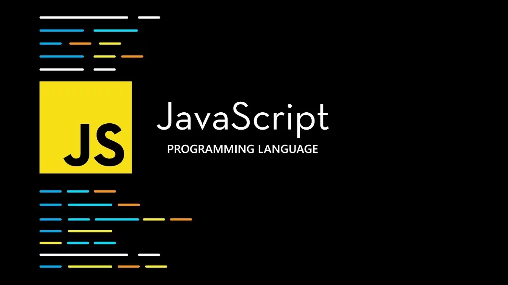
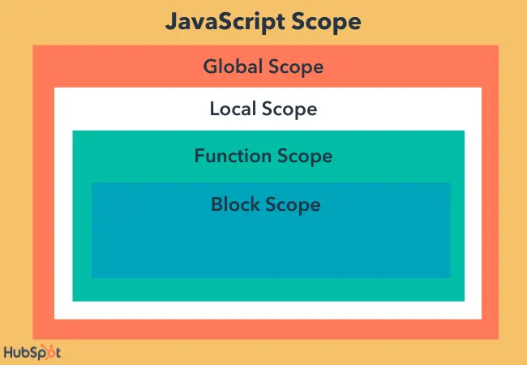
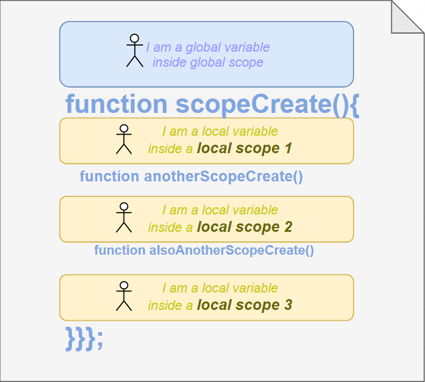
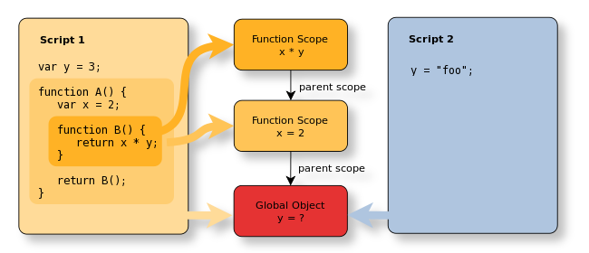
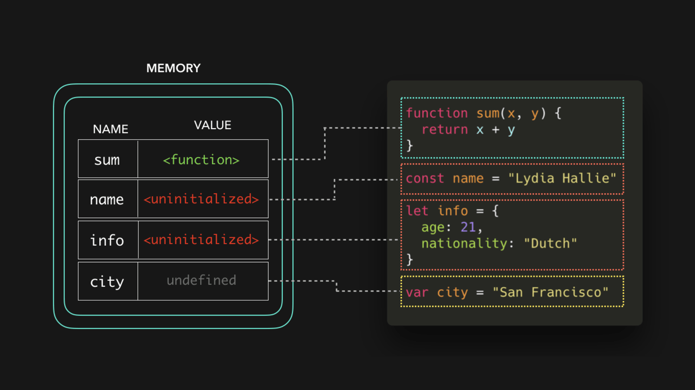

<!-- 

### Response stopped
Отправлено пользователем Copilot:
In JavaScript, scope refers to the context or environment in which variables are declared and accessed. It determines the visibility and lifetime of a variable, dictating where in your code a particular variable is valid and accessible1. Here are the key types of scope:

Block Scope: Introduced in ES6, block scope is provided by the let and const keywords. Variables declared inside a { } block are only accessible within that block. For example:

.Global scope; The defalt scope  for all code runing in script mode.

.Function Scope ; The  scope crete with function.

.Block   scope ;
Before ES6 (2015), JavaScript variables had only Global Scope and Function Scope.

ES6 introduced two important new JavaScript keywords: let and const.

These two keywords provide Block Scope in JavaScript.

Variables declared inside a { } block cannot be accessed from outside the block:

# module scope

In JavaScript, module scope refers to the visibility and accessibility of variables within a module. Let’s break it down:

### Hoisting in JavaScript refers to the process where the interpreter appears to move function and variable declarations to the top of their scope before executing the code1. Here’s what you need to know:

# Whote is function decloration 

## Function declarations are also hoisted. You can use a function before it’s declared.

 -->